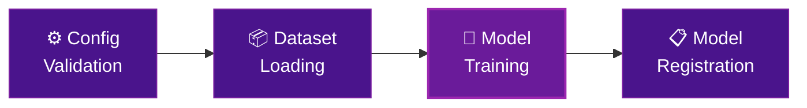

# Kubeline YOLO MLOps

An end-to-end machine learning pipeline for YOLO pose estimation, built to run on the [KAOS platform](https://novelcore.github.io/kubecore-operator/).

The pipeline takes a configuration file, loads your dataset from S3 or LakeFS, trains a YOLO pose model on a GPU node, and registers the result in MLflow — all fully automated through Argo Workflows.

## Pipeline Overview

| Step | Compute | Typical Duration |
| --- | --- | --- |
| Config Validation | CPU | Seconds |
| Dataset Loading | CPU | Minutes |
| Model Training | GPU | Hours to days |
| Model Registration | CPU | Seconds |

## Which track are you on?

- :material-rocket-launch-outline: **Quick Start**

    ---

    You already have a KAOS environment running with Argo Workflows and MLflow available.

    Jump straight to configuring your first experiment.

    [:octicons-arrow-right-24: Prerequisites](quick-start/prerequisites.md)

- :material-wrench-outline: **Platform Setup**

    ---

    You need to deploy the pipeline template on KAOS from scratch.

    Start here to provision the full infrastructure stack.

    [:octicons-arrow-right-24: Platform Setup Overview](platform-setup/index.md)

---

> **Questions?** Open an issue on [GitHub](https://github.com/novelcore/kubeline-yolo-mlops/issues).
