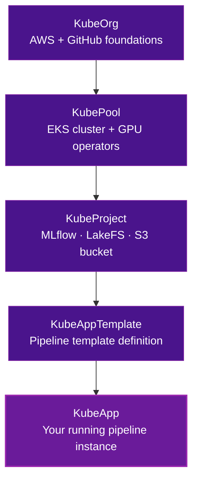

# Platform Setup Overview

This track walks you through deploying the Kubeline YOLO MLOps pipeline template on KAOS from scratch.

By the end of this track, you will have:

- A Kubernetes cluster (EKS) with GPU support via Karpenter
- MLflow and LakeFS deployed and connected to S3
- An Argo Workflows WorkflowTemplate ready to submit
- Access URLs for Argo and MLflow

## What Gets Created

The KAOS platform provisions ML infrastructure in five layers, each building on the previous:

!!! info "Each layer is a prerequisite for the next"
    If a layer is missing or not fully ready, the next layer will not reconcile. Work through the steps in order.

## Estimated Time

| Step | Estimated Time |
| --- | --- |
| KubeOrg | 5 minutes |
| KubePool (EKS cluster) | 20–30 minutes |
| KubeProject | 10 minutes |
| KubeAppTemplate | 5 minutes |
| KubeApp | 10 minutes |

Start with [Prerequisites](prerequisites.md) before creating any resources.
