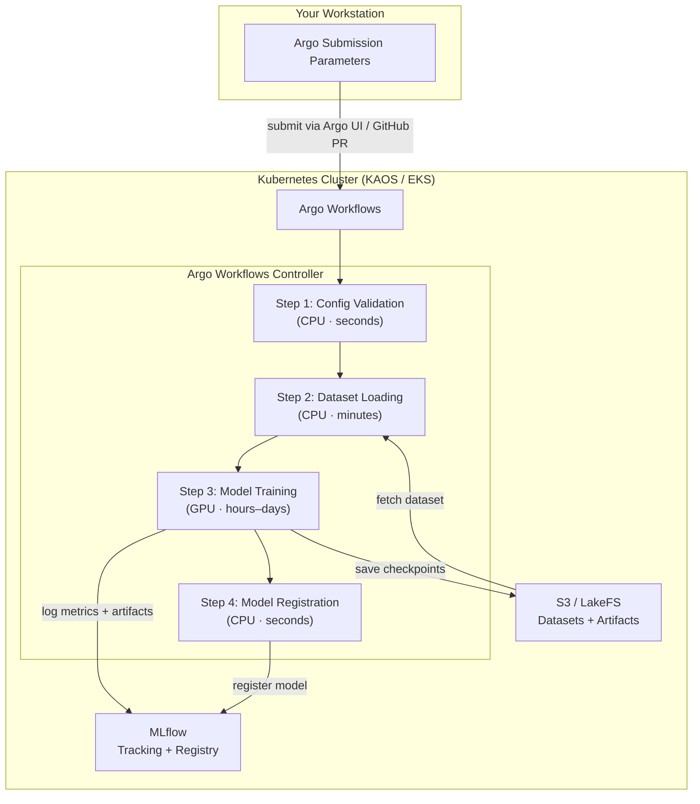
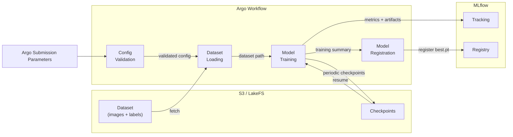

# Architecture

Technical overview of the Kubeline YOLO MLOps pipeline system.

## System Overview



## Component Roles

| Component | Role |
| --- | --- |
| **Argo Workflows** | DAG orchestration — sequences steps, manages retries, passes artifacts |
| **MLflow Tracking** | Records all parameters, metrics, and artifacts per run |
| **MLflow Model Registry** | Versions trained model checkpoints with stage labels |
| **S3 / LakeFS** | Stores datasets, checkpoints, and MLflow binary artifacts |
| **Karpenter** | Dynamically provisions GPU nodes when training starts, releases them after |
| **ECR** | Stores Docker images for each pipeline step |

## Data Flow



## Step Architecture

Every pipeline step follows the same internal pattern (Kubestep Python Template):

```
<step>/
├── app/
│   ├── cli.py          # Typer CLI — exposes the `run` command
│   ├── manager.py      # Wires config and services; calls manager.run()
│   ├── models/
│   │   ├── config.py   # Pydantic BaseSettings — reads env vars
│   │   └── domain.py   # Domain-specific models
│   └── services/
│       └── service.py  # Core business logic
├── Dockerfile          # Python 3.12 Alpine, Poetry install
└── pyproject.toml
```

Each step is a fully self-contained Python package with its own Docker image.

## Compute Allocation

GPU and CPU nodes are provisioned dynamically by Karpenter:

| Step | Node Pool | Why |
| --- | --- | --- |
| Config Validation | CPU | Lightweight validation only |
| Dataset Loading | CPU | Network I/O, no GPU needed |
| Model Training | **GPU** | CUDA-accelerated YOLO training |
| Model Registration | CPU | MLflow API calls only |

GPU nodes are provisioned when the training step starts and released when it finishes, keeping costs minimal.
