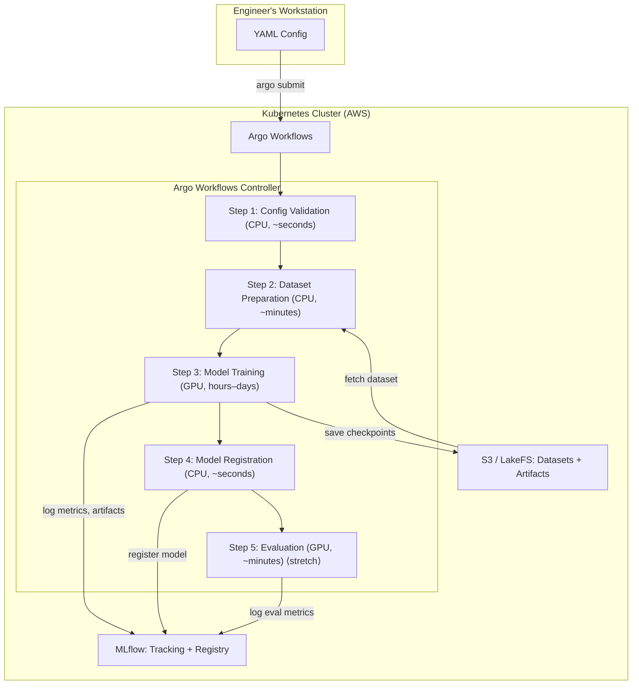
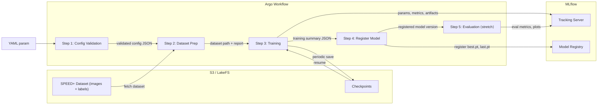

# MLOps Training Pipeline — Technical Architecture Document
## Phase 1: Spacecraft Pose Estimation · SPEED+ · YOLO Pose · Argo Workflows

| | |
|---|---|
| **Client** | Infinite Orbits |
| **Vendor** | Novelcore (Platform Team + ML Team) |
| **Document Type** | Technical Architecture — Phase 1 |
| **Parent Document** | MLOps Training Pipeline — Phase 1 PRD |
| **Version** | 1.0 – Draft |
| **Date** | February 2026 |
| **Classification** | Confidential |

---

## 1. Purpose

This document translates the Phase 1 Business PRD into a technical specification. It defines what each pipeline step does conceptually and algorithmically, the data formats at every boundary, the monorepo structure, and the integration contracts between the ML Team and Platform Team. It is intended to be the engineering reference for implementation.

---

## 2. System Architecture Overview

### 2.1 High-Level Architecture



### 2.2 Component Inventory

| Component | Role | Owner | Notes |
|---|---|---|---|
| Argo Workflows | DAG orchestration, step sequencing, retry logic, artifact passing | Platform Team deploys; ML Team authors workflows | Workflow submitted via Argo CLI with YAML as parameter |
| MLflow Tracking Server | Experiment logging (params, metrics, artifacts) | Platform Team deploys | Backend store: PostgreSQL; Artifact store: S3 |
| MLflow Model Registry | Versioned model storage with stage transitions | Platform Team deploys | Accessed via MLflow Python SDK from Steps 3 and 4 |
| S3 (AWS) | Dataset storage, checkpoints, artifacts, MLflow artifact store | Platform Team provisions | LakeFS sits in front of S3 as a versioning layer |
| LakeFS | Git-like versioning for datasets on S3 | Platform Team deploys; ML Team integrates | S3-compatible API; transparent to downstream consumers |
| Container Registry | Docker images for pipeline steps | Platform Team manages | ECR or equivalent; ML Team pushes images |
| Kubernetes | Compute substrate for all containerized steps | Platform Team manages | GPU node pools for Step 3; CPU nodes for Steps 1, 2, 4, 5 |

### 2.3 Data Flow Summary



---

## 3. Dataset Specification (Technical Detail)

### 3.1 SPEED+ Native Format

The SPEED+ dataset as published has the following structure:

```
speedplus/
├── camera.json                  # Camera intrinsic parameters
├── kpts.mat                     # 11 3D keypoints of spacecraft model (body frame)
├── synthetic/
│   ├── train.json               # Per-image pose labels (quaternion + translation)
│   ├── validation.json          # Per-image pose labels
│   └── images/
│       ├── img000001.jpg
│       └── ...                  # ~59,960 images (80/20 train/val)
├── sunlamp/
│   ├── test.json                # Per-image pose labels
│   └── images/
│       ├── img000001.jpg
│       └── ...                  # ~2,791 test images
└── lightbox/
    ├── test.json                # Per-image pose labels
    └── images/
        ├── img000001.jpg
        └── ...                  # ~6,740 test images
```

**Key data elements:**

`camera.json` contains the camera intrinsic matrix K and distortion coefficients in OpenCV convention (fx, fy, cx, cy, k1, k2, p1, p2). Image resolution is 1920x1200.

`kpts.mat` contains a `corners` matrix of shape `(3, 11)` — the 3D coordinates of 11 spacecraft landmarks in the satellite body reference frame. These are the keypoints the model must learn to detect.

`train.json` / `validation.json` / `test.json` contain per-image pose labels as quaternion (q_w, q_x, q_y, q_z) and translation vector (t_x, t_y, t_z) describing the spacecraft pose relative to the camera.

### 3.2 Target Training Format (Ultralytics YOLO Pose)

The dataset must be pre-converted to Ultralytics YOLO Pose format before it enters the pipeline. This conversion is a one-time offline process, not part of the Argo Workflow.

**Conversion algorithm (offline, out-of-pipeline):**

For each image `i` with pose label `(q_i, t_i)`:

1. Convert quaternion `q_i` to rotation matrix `R_i` (3x3).
2. For each of the 11 3D keypoints `P_k` from `kpts.mat`, project to camera frame: `p_cam = R_i * P_k + t_i`, then project to image plane: `p_2d = K * p_cam` (divide by z to get pixel coordinates `(u, v)`). Apply distortion correction if needed using the OpenCV distortion model.
3. Compute bounding box as the axis-aligned envelope of all 11 projected 2D keypoints, with a configurable margin (e.g., 10–20% padding).
4. Normalize all coordinates to `[0, 1]` relative to image dimensions (1920x1200).
5. Determine visibility flag for each keypoint: `v=2` (visible) if `p_cam.z > 0` (in front of camera), `v=0` (not labeled) otherwise.

**Output label format** (one `.txt` file per image):

```
<class_id> <x_center> <y_center> <width> <height> <px1> <py1> <v1> <px2> <py2> <v2> ... <px11> <py11> <v11>
```

Where all spatial values are normalized to `[0, 1]` and `class_id = 0` (single class: spacecraft). Each line has 5 + (11 x 3) = 38 values.

**Output dataset structure:**

```
speedplus_yolo/
├── data.yaml
├── images/
│   ├── train/
│   │   ├── img000001.jpg → ...
│   ├── val/
│   │   ├── img000001.jpg → ...
│   └── test/       # lightbox + sunlamp images
│       ├── img000001.jpg → ...
└── labels/
    ├── train/
    │   ├── img000001.txt → ...
    ├── val/
    │   ├── img000001.txt → ...
    └── test/
        ├── img000001.txt → ...
```

**`data.yaml`:**

```yaml
path: /data/speedplus_yolo
train: images/train
val: images/val
test: images/test

kpt_shape: [11, 3]      # 11 keypoints, 3 dims (x, y, visibility)
flip_idx: []             # No horizontal flip symmetry for spacecraft
names:
  0: spacecraft
```

Note: `flip_idx` is empty because a spacecraft is not left-right symmetric in the same way a human body is. Horizontal flip augmentation should be disabled or used with caution.

### 3.3 Dataset Location and Versioning

The converted dataset is stored in S3 at a path like `s3://io-mlops/datasets/speedplus_yolo/v1/`. When LakeFS is operational, this becomes a LakeFS branch/commit reference such as `lakefs://datasets/speedplus_yolo@main` accessible via LakeFS's S3-compatible gateway. The experiment YAML references this path, and the pipeline treats it as an opaque S3 endpoint.

### 3.4 Dataset Sampling Algorithm

When the experiment config specifies a `sample_size` (e.g., 1000 or 5000), Step 2 generates a reproducible subset of the full dataset.

**Algorithm:**

1. Read the list of all image filenames from the specified dataset split.
2. Initialize a pseudorandom number generator with the configured `seed` (from experiment YAML).
3. Perform a seeded random sample of `sample_size` images (without replacement).
4. Copy the selected images and their corresponding label `.txt` files to a temporary working directory.
5. Generate a new `data.yaml` pointing to the sampled subset.

The seed ensures reproducibility: the same `(dataset_version, sample_size, seed)` tuple always produces the same subset.

---

## 4. Pipeline Steps — Technical Specification

### 4.1 Step 1: Config Validation

**Purpose:** Fail fast on invalid experiment configurations before any compute resources are allocated.

**Container:** CPU-only, lightweight Python image.

**Input:** Experiment YAML passed as an Argo workflow parameter.

**Algorithm:**

1. Parse the YAML and validate against the experiment schema (using a JSON Schema or Pydantic model).
2. **Schema checks:** Required fields present (`experiment.name`, `model.variant`, `dataset.version`, `training.epochs`, `training.batch_size`, `training.image_size`). `model.variant` is one of the valid YOLO Pose variants (v8 through v11, sizes n/s/m/l/x). Numeric ranges enforced (`epochs > 0`, `batch_size > 0`, `learning_rate > 0`, `image_size` multiple of 32). `checkpointing.interval_epochs > 0`. Early stopping `patience > 0`.
3. **Liveness checks:** Verify the dataset path exists in S3/LakeFS (HEAD request or `ls` on the prefix). Verify the pretrained weights reference is a valid Ultralytics model name or an S3 path to a `.pt` file. Verify MLflow tracking URI is reachable (HTTP health check).
4. **Checkpoint resume check:** If `checkpointing.resume_from` is set to a specific path, verify the checkpoint `.pt` file exists. If set to `"auto"`, scan the experiment's checkpoint directory for the latest checkpoint.

**Output:** Validated config as a JSON artifact passed to subsequent steps. On failure, the workflow terminates with a descriptive error message logged to Argo.

**Failure modes:** Missing fields → error with field name. Invalid model variant → error with list of valid variants. Unreachable dataset → error with S3 path. Unreachable MLflow → error with URI.

---

### 4.2 Step 2: Dataset Preparation

**Purpose:** Fetch the specified dataset (or a sample) from S3/LakeFS, validate integrity, and make it available for the training step.

**Container:** CPU-only Python image with `boto3`, `pyyaml`, `numpy`.

**Input:** Validated config JSON from Step 1.

**Algorithm:**

1. **Resolve dataset reference:** Read `dataset.version` and `dataset.source` from config. Construct the S3/LakeFS path (e.g., `s3://io-mlops/datasets/speedplus_yolo/v1/` or `lakefs://datasets/speedplus_yolo@<commit>`).

2. **Fetch dataset:** If `dataset.sample_size` is specified, list all image filenames in the `images/train/` prefix, apply the seeded random sampling algorithm (Section 3.4) to select `sample_size` images, download only the selected images and corresponding labels to local storage, and generate a new `data.yaml` for the sample. If `dataset.sample_size` is null (full dataset), download or mount the full dataset via S3 FUSE or pre-populated PVC.

3. **Validate integrity:** For each image file, verify a corresponding `.txt` label file exists. For each label file, verify it has the expected number of columns (38 values per line). Verify `data.yaml` is valid and references existing directories. Count total images per split and report.

4. **Prepare output:** Write the dataset to a location accessible by Step 3 (shared PVC or S3 path — decided by Platform Team). Write a validation report JSON containing `total_images`, `total_labels`, `mismatches`, `split_counts`, and `sample_seed`.

**Output:** Mounted dataset path (as an Argo artifact or parameter); validation report JSON.

**Failure modes:** Dataset path not found → fail with path details. Image-label mismatch → fail with list of mismatched files. Malformed labels → fail with file names and line numbers.

---

### 4.3 Step 3: Model Training

**Purpose:** Train a YOLO Pose model using the Ultralytics built-in trainer with full experiment tracking via MLflow.

**Container:** GPU-enabled Python image with `ultralytics`, `torch`, `mlflow`, `boto3`.

**Input:** Validated config JSON; dataset path from Step 2; optionally a checkpoint path for resume.

**Algorithm:**

**1. Initialize MLflow run.** Connect to the MLflow tracking server using the URI from the config. Create or set the experiment (using `experiment.name`), then start a new run.

**2. Log experiment metadata to MLflow.** All hyperparameters from the YAML are logged as MLflow params. Additional metadata includes dataset version, sample size, seed, and the Git commit hash of the training code (set as an environment variable during container build). The complete experiment YAML is logged as an artifact.

**3. Initialize YOLO model.** Load the model using Ultralytics:

```python
from ultralytics import YOLO
model = YOLO(config.model.variant)  # e.g., "yolov8n-pose.pt"
```

If `config.model.pretrained_weights` specifies a custom S3 path, download and load those weights instead.

**4. Configure training arguments.** Map the experiment YAML fields to Ultralytics training arguments:

| YAML Field | Ultralytics Arg | Notes |
|---|---|---|
| `training.epochs` | `epochs` | |
| `training.batch_size` | `batch` | |
| `training.learning_rate` | `lr0` | Initial learning rate |
| `training.optimizer` | `optimizer` | SGD, Adam, AdamW |
| `training.image_size` | `imgsz` | |
| `training.scheduler.cos_lr` | `cos_lr` | Boolean for cosine LR |
| `checkpointing.interval_epochs` | `save_period` | Saves every N epochs |
| `early_stopping.patience` | `patience` | Epochs without improvement before stop |
| `augmentation.*` | Various | `mosaic`, `mixup`, `degrees`, `flipud`, etc. |
| `checkpointing.resume_from` | `resume` | Path to checkpoint or False |

**5. Execute training.** Call `model.train(...)` with the mapped arguments. Ultralytics handles the training loop internally: data loading with on-the-fly augmentation, loss computation, backpropagation, checkpoint saving, and early stopping based on validation metric plateau.

**6. Metrics logging callback.** Register a custom Ultralytics callback (or use the built-in MLflow integration via `MLFLOW_TRACKING_URI` environment variable) that logs metrics at the end of each epoch:

- `train/box_loss`, `train/pose_loss`, `train/kobj_loss`, `train/cls_loss`
- `val/box_loss`, `val/pose_loss`, `val/kobj_loss`, `val/cls_loss`
- `metrics/mAP50`, `metrics/mAP50-95`
- `metrics/precision`, `metrics/recall`
- `lr/pg0`, `lr/pg1`, `lr/pg2` (learning rate per param group)

Note: Ultralytics has a built-in MLflow integration. The decision on whether to use it directly or implement a custom callback will be finalized during development after testing both approaches.

**7. Checkpoint management.** Ultralytics saves `best.pt` (best validation metric) and `last.pt` (latest epoch) automatically, plus periodic checkpoints if `save_period` is set. After training completes (or on interruption), upload `best.pt` and `last.pt` to the experiment's S3 checkpoint directory and log them as MLflow artifacts.

**8. Divergence / early stopping.** The built-in Ultralytics `patience` parameter handles loss plateau detection. If the monitored validation metric does not improve for `patience` epochs, training halts automatically. The best checkpoint up to that point is preserved.

**9. OOM handling.** If training crashes with a CUDA OOM error, the step fails. The last saved checkpoint is preserved in S3. The Argo step logs include the error message and a suggestion to reduce `batch_size` or `image_size`. The engineer resubmits with adjusted config and `resume_from: auto`.

**10. Output.** Write a training summary JSON artifact:

```json
{
  "mlflow_run_id": "abc123",
  "mlflow_experiment_name": "spacecraft-pose-v1",
  "best_model_path": "s3://io-mlops/checkpoints/exp-001/best.pt",
  "last_model_path": "s3://io-mlops/checkpoints/exp-001/last.pt",
  "final_metrics": {
    "mAP50": 0.85,
    "mAP50-95": 0.72,
    "pose_loss": 0.034
  },
  "epochs_completed": 100,
  "early_stopped": false,
  "total_training_time_hours": 11.4,
  "gpu_type": "A100-40GB",
  "gpu_count": 2
}
```

**Failure modes:** OOM → step fails, checkpoint preserved, log includes mitigation suggestions. CUDA error → same pattern. MLflow unreachable mid-training → training continues, metrics buffered locally and flushed on reconnect. Dataset mount failure → step fails before GPU allocation.

---

### 4.4 Step 4: Model Registration

**Purpose:** Register the trained model in MLflow's model registry with full lineage metadata.

**Container:** CPU-only Python image with `mlflow`, `boto3`.

**Input:** Training summary JSON from Step 3 (contains MLflow run ID, model paths).

**Algorithm:**

1. **Connect to MLflow** using the tracking URI from the validated config.

2. **Register best model.** Call `mlflow.register_model()` with the model URI from the run, creating a new version in the registry under the name `"spacecraft-pose-yolo"`.

3. **Register last model.** Register `last.pt` as a separate artifact under the same model name, tagged to distinguish it from `best.pt`.

4. **Tag the model version** with lineage metadata: `dataset_version` (LakeFS commit hash or S3 path), `dataset_sample_size` (full or N), `config_hash` (SHA-256 of the experiment YAML), `git_commit` (code version), `model_variant` (e.g., `yolov8n-pose`), `training_run_id` (MLflow run ID), `best_mAP50` (final best validation mAP).

5. **Set model stage** to `None` (default). Promotion to `Staging` or `Production` is a manual action by the engineer via MLflow UI.

**Output:** Registered model version number, logged to Argo step output.

**Failure modes:** MLflow unreachable → retry with exponential backoff (3 attempts), then fail. Model file not found at S3 path → fail with path details.

---

### 4.5 Step 5: Evaluation (Stretch Goal)

**Purpose:** Run batch inference on a held-out test set and compute domain-specific pose estimation metrics.

**Container:** GPU-enabled Python image with `ultralytics`, `mlflow`, `numpy`, `scipy`, `opencv-python`.

**Input:** Registered model (loaded from MLflow registry or S3 path); test dataset split.

**Algorithm:**

**1. Load model** from the best checkpoint path.

**2. Run batch inference** on the test split (lightbox + sunlamp images). For each image, extract predicted 2D keypoints from the YOLO Pose output.

**3. Reconstruct pose from predicted keypoints.** Using the known 3D keypoints (`kpts.mat`) and camera intrinsics (`camera.json`), solve the Perspective-n-Point (PnP) problem. Input: 11 predicted 2D keypoints + 11 known 3D keypoints + camera matrix K. Method: `cv2.solvePnPRansac` for robustness to outlier keypoints. Output: estimated rotation vector `rvec` and translation vector `tvec`.

**4. Compute pose estimation metrics.** Compare predicted pose `(R_pred, t_pred)` against ground truth `(R_gt, t_gt)` for each test image:

- **Translation error (Euclidean distance):** `e_t = ||t_pred - t_gt||_2` (meters)
- **Rotation error (geodesic distance):** `e_r = arccos((trace(R_gt^T * R_pred) - 1) / 2)` (radians, converted to degrees)
- **Aggregate metrics:** mean and median translation error, mean and median rotation error, percentage of images below configurable thresholds (e.g., < 10cm translation AND < 5 degrees rotation)

**5. Compute standard YOLO metrics** from Ultralytics validation: mAP50, mAP50-95 for bounding box detection, and OKS-based mAP for keypoint detection.

**6. Error analysis (if time permits).** Distribution of errors by domain (lightbox vs. sunlamp), worst-case images (highest error), and visualization overlays of predicted keypoints + bounding box on sample test images.

**7. Log results to MLflow.** All computed metrics logged as MLflow metrics. Error distribution plots and sample visualizations logged as artifacts. Full metrics JSON logged as artifact.

**Output:** Evaluation metrics JSON; optional error analysis report; optional visualization images.

---

## 5. Experiment Configuration Schema

### 5.1 Complete YAML Schema

```yaml
# --- Experiment Metadata ---
experiment:
  name: "spacecraft-pose-v1-yolov8n"          # Required. Used as MLflow experiment name
  description: "Baseline YOLOv8n-pose on SPEED+ synthetic full dataset"
  tags:                                        # Optional. Logged to MLflow
    project: "infinite-orbits"
    phase: "1"
    
# --- Dataset Configuration ---
dataset:
  version: "v1"                                # Required. Maps to S3/LakeFS path
  source: "s3"                                 # "s3" or "lakefs"
  path_override: null                          # Optional. Full S3 path override
  sample_size: null                            # Optional. null = full dataset
  seed: 42                                     # Seed for reproducible sampling
  
# --- Model Configuration ---
model:
  variant: "yolov8n-pose.pt"                   # Required. Ultralytics model name
  pretrained_weights: null                      # Optional. Custom .pt path on S3
  
# --- Training Hyperparameters ---
training:
  epochs: 100
  batch_size: 16
  image_size: 640                              # Ultralytics imgsz
  learning_rate: 0.01                          # lr0
  optimizer: "SGD"                             # SGD | Adam | AdamW
  scheduler:
    cos_lr: true                               # Cosine LR schedule
    lrf: 0.01                                  # Final LR factor
  warmup_epochs: 3.0
  warmup_momentum: 0.8
  weight_decay: 0.0005
  
# --- Checkpointing ---
checkpointing:
  interval_epochs: 10                          # Save checkpoint every N epochs
  storage_path: "s3://io-mlops/checkpoints"    # Base path; experiment name appended
  resume_from: null                            # null | "auto" | specific S3 path to .pt

# --- Early Stopping ---
early_stopping:
  patience: 50                                 # Epochs without improvement before stop
  
# --- Augmentation (passed directly to Ultralytics) ---
augmentation:
  hsv_h: 0.015
  hsv_s: 0.7
  hsv_v: 0.4
  degrees: 0.0
  translate: 0.1
  scale: 0.5
  flipud: 0.0                                 # Vertical flip probability
  fliplr: 0.0                                 # Horizontal flip — disabled for spacecraft
  mosaic: 1.0
  mixup: 0.0

# --- Resource Requests (informational for Phase 1) ---
resources:
  gpu_count: 2
  gpu_type: "A100-40GB"                        # Informational; actual allocation by Platform Team
  cpu_cores: 32
  memory_gb: 128
```

### 5.2 Schema Validation Rules

| Field | Type | Required | Constraints |
|---|---|---|---|
| `experiment.name` | string | Yes | Non-empty, alphanumeric + hyphens |
| `model.variant` | string | Yes | Must match a valid YOLO Pose variant (v8–v11, sizes n/s/m/l/x) |
| `dataset.version` | string | Yes | Non-empty |
| `dataset.sample_size` | int or null | No | If set, must be > 0 |
| `dataset.seed` | int | No | Default: 42 |
| `training.epochs` | int | Yes | > 0 |
| `training.batch_size` | int | Yes | > 0, power of 2 recommended |
| `training.image_size` | int | Yes | > 0, multiple of 32 |
| `training.learning_rate` | float | Yes | > 0, typically 1e-5 to 1e-1 |
| `checkpointing.interval_epochs` | int | Yes | > 0 |
| `checkpointing.resume_from` | string or null | No | null, "auto", or valid S3 path |
| `early_stopping.patience` | int | Yes | > 0 |

---

## 6. Monorepo Structure

```
io-mlops/
├── README.md
├── pyproject.toml                         # Top-level Python project (monorepo)
├── Makefile                               # Common commands: lint, test, build
│
├── configs/                               # Experiment YAML configs
│   ├── baseline_yolov8n.yaml
│   ├── baseline_yolov8s.yaml
│   └── ...
│
├── docker/                                # Dockerfiles per step type
│   ├── Dockerfile.cpu                     # Steps 1, 2, 4
│   ├── Dockerfile.gpu                     # Steps 3, 5
│   └── requirements/
│       ├── base.txt
│       ├── cpu.txt
│       └── gpu.txt
│
├── workflows/                             # Argo Workflow templates
│   ├── training-pipeline.yaml             # Main DAG workflow
│   ├── templates/
│   │   ├── config-validation.yaml
│   │   ├── dataset-preparation.yaml
│   │   ├── model-training.yaml
│   │   ├── model-registration.yaml
│   │   └── evaluation.yaml
│   └── scripts/
│       └── submit.sh                      # Convenience wrapper for argo submit
│
├── src/
│   └── io_mlops/                          # Python package
│       ├── __init__.py
│       ├── config/
│       │   ├── __init__.py
│       │   ├── schema.py                  # Pydantic model for experiment YAML
│       │   └── validation.py              # Liveness checks (S3, MLflow)
│       │
│       ├── data/
│       │   ├── __init__.py
│       │   ├── fetch.py                   # S3/LakeFS download logic
│       │   ├── sample.py                  # Seeded random sampling
│       │   └── validate.py                # Image-label integrity checks
│       │
│       ├── training/
│       │   ├── __init__.py
│       │   ├── trainer.py                 # Ultralytics training wrapper
│       │   ├── callbacks.py               # MLflow logging callbacks
│       │   └── checkpoint.py              # Checkpoint upload/resume logic
│       │
│       ├── registry/
│       │   ├── __init__.py
│       │   └── register.py                # MLflow model registration
│       │
│       ├── evaluation/                    # Stretch goal
│       │   ├── __init__.py
│       │   ├── inference.py               # Batch inference runner
│       │   ├── pnp_solver.py              # PnP pose reconstruction
│       │   ├── metrics.py                 # Pose error metrics
│       │   └── visualization.py           # Overlay keypoints on images
│       │
│       └── utils/
│           ├── __init__.py
│           ├── s3.py                      # S3/LakeFS client wrapper
│           └── mlflow_utils.py            # MLflow connection helpers
│
├── scripts/                               # Standalone utility scripts
│   ├── convert_speedplus_to_yolo.py       # One-time offline dataset conversion
│   └── generate_sample.py                 # Local sampling for engineer use
│
├── tests/
│   ├── test_config_validation.py
│   ├── test_data_sampling.py
│   ├── test_data_validation.py
│   ├── test_training_callbacks.py
│   └── test_metrics.py
│
└── docs/
    ├── architecture.md                    # This document
    ├── runbook.md                         # Operations guide
    └── user_guide.md                      # How to run experiments
```

**Key design decisions:**

Two Docker images (CPU and GPU) rather than one per step. Steps 1, 2, 4 share the CPU image; Steps 3, 5 share the GPU image. This minimizes build complexity while keeping GPU images from being required where they aren't needed.

Experiment configs live in `configs/` and are committed to Git, providing a full audit trail.

The `src/io_mlops/` package is pip-installable (`pip install -e .`), making it importable both inside containers and in local development.

The offline conversion script (`scripts/convert_speedplus_to_yolo.py`) is separate from the pipeline code, emphasizing that conversion is a one-time prerequisite.

---

## 7. Argo Workflow Architecture

### 7.1 Workflow Submission

The engineer submits a training run via Argo CLI:

```bash
argo submit workflows/training-pipeline.yaml \
  -p config="$(cat configs/baseline_yolov8n.yaml)"
```

The entire experiment YAML is passed as a single string parameter. Step 1 parses and validates it; subsequent steps receive the validated config as an Argo artifact.

### 7.2 Workflow DAG (Simplified)

```yaml
apiVersion: argoproj.io/v1alpha1
kind: Workflow
metadata:
  generateName: training-
spec:
  entrypoint: training-pipeline
  arguments:
    parameters:
      - name: config
  templates:
    - name: training-pipeline
      dag:
        tasks:
          - name: validate-config
            template: config-validation
            arguments:
              parameters:
                - name: config
                  value: "{{workflow.parameters.config}}"

          - name: prepare-dataset
            template: dataset-preparation
            dependencies: [validate-config]
            arguments:
              artifacts:
                - name: validated-config
                  from: "{{tasks.validate-config.outputs.artifacts.validated-config}}"

          - name: train-model
            template: model-training
            dependencies: [prepare-dataset]
            arguments:
              artifacts:
                - name: validated-config
                  from: "{{tasks.validate-config.outputs.artifacts.validated-config}}"
                - name: dataset-info
                  from: "{{tasks.prepare-dataset.outputs.artifacts.dataset-info}}"

          - name: register-model
            template: model-registration
            dependencies: [train-model]
            arguments:
              artifacts:
                - name: training-summary
                  from: "{{tasks.train-model.outputs.artifacts.training-summary}}"
                - name: validated-config
                  from: "{{tasks.validate-config.outputs.artifacts.validated-config}}"
```

### 7.3 Artifact Passing Strategy

Artifacts flow between steps via Argo's native artifact mechanism. Small artifacts (config JSON, summary JSON, validation reports) are passed directly through Argo's artifact store (S3-backed). Large artifacts (datasets, model checkpoints) are referenced by S3 path — the artifact contains the path string, not the data itself.

| Artifact | Size | Passing Method |
|---|---|---|
| Validated config JSON | ~1 KB | Argo artifact (direct) |
| Dataset validation report | ~1 KB | Argo artifact (direct) |
| Dataset path reference | ~100 B | Argo parameter or artifact |
| Trained model (.pt) | 10–200 MB | S3 path reference in training summary JSON |
| Checkpoints | 10–200 MB each | S3 path; managed by Ultralytics + upload script |
| Training summary JSON | ~1 KB | Argo artifact (direct) |

### 7.4 Resource Requests per Step

| Step | CPU | Memory | GPU | Storage | Estimated Duration |
|---|---|---|---|---|---|
| 1: Config Validation | 1 core | 512 MB | None | Minimal | ~5 seconds |
| 2: Dataset Preparation | 4 cores | 8 GB | None | Up to 20 GB | 1–30 minutes |
| 3: Model Training | 32 cores | 128 GB | 2x A100-40GB | 10 TB | 2–48 hours |
| 4: Model Registration | 1 core | 1 GB | None | Minimal | ~10 seconds |
| 5: Evaluation (stretch) | 8 cores | 32 GB | 1x A100-40GB | 5 GB | 10–60 minutes |

---

## 8. MLflow Integration Architecture

### 8.1 Tracking Hierarchy

```
MLflow Tracking Server
└── Experiment: "spacecraft-pose-v1"           ← experiment.name from YAML
    ├── Run: "baseline-yolov8n-full-dataset"   ← experiment.description
    │   ├── Parameters: {epochs, batch_size, lr, model_variant, dataset_version, ...}
    │   ├── Metrics: {train/loss, val/loss, mAP50, mAP50-95, ...} x N epochs
    │   ├── Artifacts: {config.yaml, best.pt, last.pt, training_summary.json}
    │   └── Tags: {git_commit, config_hash, gpu_type}
    │
    ├── Run: "yolov8s-sample-5k"
    │   └── ...
    └── ...

MLflow Model Registry
└── Model: "spacecraft-pose-yolo"
    ├── Version 1 ← linked to Run "baseline-yolov8n-full-dataset"
    │   ├── Tags: {dataset_version, model_variant, best_mAP50}
    │   └── Stage: None
    ├── Version 2 ← linked to Run "yolov8s-sample-5k"
    │   └── Stage: Staging
    └── ...
```

### 8.2 Ultralytics MLflow Callback

Ultralytics has built-in MLflow support activated by setting the `MLFLOW_TRACKING_URI` environment variable. This logs basic metrics and artifacts automatically. However, for full control over what gets logged (especially custom tags, dataset version, and config artifacts), a custom callback may be implemented:

```python
# Conceptual — not production code
def on_train_epoch_end(trainer):
    metrics = {
        "train/box_loss": trainer.loss_items[0],
        "train/pose_loss": trainer.loss_items[1],
        "train/kobj_loss": trainer.loss_items[2],
        "train/cls_loss": trainer.loss_items[3],
    }
    mlflow.log_metrics(metrics, step=trainer.epoch)

def on_val_end(validator):
    metrics = {
        "val/mAP50": validator.metrics.box.map50,
        "val/mAP50-95": validator.metrics.box.map,
    }
    mlflow.log_metrics(metrics, step=validator.epoch)
```

The decision on whether to use the built-in integration or the custom callback will be finalized during development after testing both approaches.

---

## 9. Checkpoint and Resume Architecture

### 9.1 Checkpoint Storage Layout

```
s3://io-mlops/checkpoints/
└── {experiment_name}/
    └── {run_id}/
        ├── best.pt              # Best validation metric
        ├── last.pt              # Latest epoch
        ├── epoch_10.pt          # Periodic checkpoint
        ├── epoch_20.pt
        └── ...
```

### 9.2 Resume Flow

```
Engineer resubmits YAML with:
  checkpointing:
    resume_from: "auto"

Step 1 (Validation):
  → Scans s3://io-mlops/checkpoints/{experiment_name}/ for latest run
  → Finds last.pt, verifies it is loadable
  → Sets resume_path in validated config

Step 3 (Training):
  → Downloads last.pt from S3
  → Calls model.train(resume=True) which loads optimizer state, epoch counter, etc.
  → Training continues from where it left off
  → New MLflow run created, tagged with "resumed_from: {previous_run_id}"
```

### 9.3 Ultralytics Resume Behavior

When `resume=True` is passed with a valid checkpoint path, Ultralytics restores the model weights and optimizer state, the epoch counter (training continues from epoch N+1), the best fitness value (for early stopping comparison), and the learning rate scheduler state. This is a native Ultralytics feature and requires no custom implementation beyond ensuring the checkpoint file is accessible.

---

## 10. Error Handling Matrix

| Failure | Step | Detection | Response | Recovery |
|---|---|---|---|---|
| Invalid YAML syntax | 1 | YAML parser exception | Workflow fails immediately with line number | Fix YAML, resubmit |
| Invalid field value | 1 | Pydantic validation error | Workflow fails with invalid fields listed | Fix config, resubmit |
| Dataset not found in S3 | 1 | S3 HEAD request fails | Workflow fails with S3 path | Verify dataset upload, resubmit |
| MLflow unreachable | 1 | HTTP health check fails | Workflow fails with URI | Platform Team investigates |
| Image-label mismatch | 2 | Integrity validation | Workflow fails with mismatch report | Fix dataset, re-upload, resubmit |
| CUDA OOM | 3 | PyTorch CUDA exception | Step fails; checkpoint preserved; log suggests reducing batch_size/imgsz | Adjust config, resubmit with resume |
| Training not converging | 3 | Ultralytics patience mechanism | Training stops early; best checkpoint preserved | Analyze in MLflow; adjust hyperparameters |
| Unexpected training crash | 3 | Argo detects exit code != 0 | Step fails; last saved checkpoint preserved | Resubmit with resume_from: auto |
| Node failure (K8s) | 3 | Argo/K8s detects pod eviction | Step marked failed; checkpoint preserved if save_period was reached | Resubmit with resume_from: auto |
| MLflow down during training | 3 | MLflow client exception | Training continues; metrics buffered locally | Manual metric upload if needed |
| Model registration fails | 4 | MLflow API error | Retry 3x with exponential backoff; then fail | Platform Team investigates MLflow |
| PnP solve fails (eval) | 5 | cv2.solvePnP returns false | Skip image; log as failed | Review keypoint predictions |

---

## 11. Responsibility Boundaries (Technical)

| Deliverable | ML Team | Platform Team |
|---|---|---|
| Experiment YAML schema + validation logic | Implements | — |
| Argo Workflow DAG definitions | Authors | Reviews, deploys |
| Docker images (CPU + GPU) | Builds, pushes | Provides registry access |
| Python pipeline code (`src/io_mlops/`) | Develops, tests | — |
| Ultralytics training integration | Implements | — |
| MLflow client integration | Implements | Deploys MLflow server |
| S3/LakeFS data access patterns | Implements | Provisions buckets, IAM, LakeFS |
| Kubernetes resource specs per step | Specifies requirements | Configures node pools, quotas |
| Argo artifact store configuration | Specifies requirements | Configures S3 backend |
| Dataset format conversion script | Develops | — |
| CI/CD for container builds | Collaborates | Implements pipeline |
| GPU node pool sizing | Specifies GPU type/count | Provisions, manages autoscaling |
| Network policies (MLflow, S3 access) | Specifies endpoints | Implements policies |

---

## 12. Open Questions for Platform Team

| # | Question | Impact | Needed By |
|---|---|---|---|
| 1 | Artifact passing strategy: shared PVC, S3 intermediary, or Argo native artifacts? | Affects Step 2 to Step 3 data flow and performance | Development start |
| 2 | Container strategy: two images (CPU/GPU) as proposed, or different preference? | Affects Dockerfile structure and build pipeline | Development start |
| 3 | GPU node pool: on-demand, spot, or mixed? Autoscaling policy? | Affects training reliability and cost | Development phase |
| 4 | Argo namespace and RBAC: what access model for ML Team? | Affects workflow submission and debugging | Development start |
| 5 | Container registry: ECR? What naming/tagging convention? | Affects CI/CD pipeline | Development start |
| 6 | LakeFS deployment timeline? | Determines when to switch from raw S3 paths | Mid-development |
| 7 | MLflow version and backend store choice (PostgreSQL vs. MySQL)? | Affects client SDK version and feature availability | Development start |
| 8 | S3 bucket naming and folder structure convention? | Affects all S3 paths in code | Development start |
| 9 | Grafana dashboards: any Phase 1 expectations despite PRD deferral? | Scope creep risk | Discovery |
